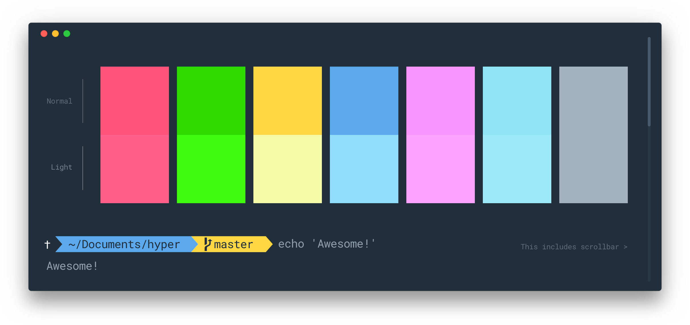

# hyper-quicktheme

> Elegant [Hyper](https://hyper.is) theme with bright and modern colors

## Install

Add `hyper-quickstyle` to the plugins list in your `~/.hyper.js` config file and restart Hyper.

## Other Plugins for Hyper
- [hyper-quickssh](https://github.com/edhuardotierrez/hyper-quickssh) - Quick List for your Favorites SSH or others Shell commands.

## License
MIT © [MIT License](https://opensource.org/licenses/MIT)